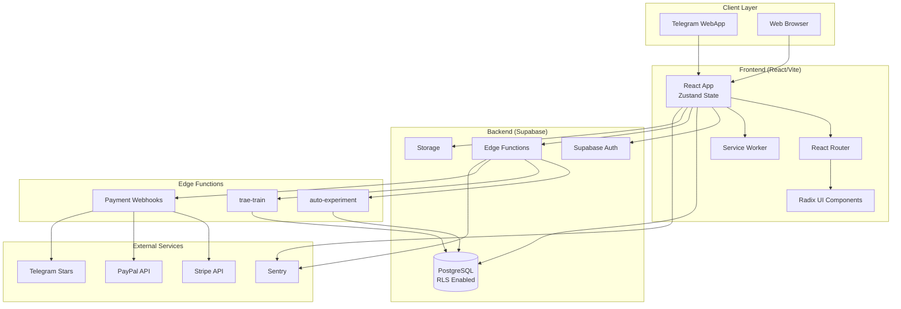

# 🎯 NEUROPUL AI — AAA IMPLEMENTATION ROADMAP

**Version:** 1.0
**Target:** Production-grade, 100% ready, AAA quality
**Timeline:** 22 weeks (solo) | 14 weeks (3-person team)
**Last Updated:** 2025-10-11

---

## 🏗️ ARCHITECTURE OVERVIEW

### System Diagram (Mermaid)



### Data Flow: Critical Paths

#### 1. Authentication
```
User → Telegram WebApp → initData → Supabase Edge Function (verify)
→ Supabase Auth (createUser) → Session Token → Client Storage
```

#### 2. Payment (Stripe Example)
```
User → PaywallModal → Stripe SDK (createPaymentIntent)
→ Stripe Elements → confirmPayment → Webhook (server)
→ Edge Function (validate signature) → DB (insert payments_tx)
→ DB (update profile.premium_until) → Client (refetch profile)
```

#### 3. Mission + XP Sync
```
User completes mission → Client (optimistic update)
→ Supabase (insert mission_progress) → Trigger (award_xp)
→ DB Function (calculate level) → Client (poll or realtime subscription)
```

#### 4. AI Coach Interaction
```
User input → trae-train Edge Function → OpenAI API (with archetype context)
→ Store interaction in DB → Return response → Client (stream or full)
```

---

## 📅 PHASED IMPLEMENTATION PLAN

### **PHASE 0: UNBLOCK & FOUNDATION** ⏱️ 2 days

**Goal:** Fix immediate blockers, create directory structure, validate tooling

#### Tasks

- [ ] **Fix npm install**
  - Update `@lhci/cli` to `^0.13.0` (or remove if Lighthouse CI not critical for MVP)
  - Remove `@types/web-vitals` (use inline types or remove web-vitals tracking)
  - Run `npm install` and verify all deps resolve
  - Commit lockfile

- [ ] **Move secrets safely**
  - Move `.env` → `.env.production` (for reference only)
  - Create `.env.local` with real credentials (add to `.gitignore`)
  - Verify `.env.local` is gitignored
  - Update `.env.local.example` to match all required keys

- [ ] **Create directory structure**
  ```
  /src
    /components
      /ui (shadcn-style primitives)
      /layout (Header, Footer, Shell)
      /features (domain-specific components)
    /pages (route components)
    /lib
      /supabase
      /telegram
      /payments
      /ai
    /hooks
    /utils
    /types
    /constants
    main.tsx
    App.tsx
    routes.tsx
  /supabase
    /migrations
    /seed
    /functions
      /auto-experiment
      /trae-train
      /stripe-webhook
  /tests
    /unit
    /e2e
    /a11y
  /scripts
  /public
    /icons
  ```

- [ ] **Validate tooling**
  - Create minimal `src/main.tsx` (console.log only)
  - Run `npm run dev` → verify Vite starts
  - Run `npm run build` → verify build succeeds
  - Run `npm run typecheck` → verify tsc works

**Acceptance Criteria:**
- `npm install` completes without errors
- `npm run build` produces `/dist` with valid index.html
- No secrets in git history
- Directory structure matches plan

---

### **PHASE 1: CORE APPLICATION SHELL** ⏱️ 3 weeks

**Goal:** React app skeleton, routing, basic UI, state management

#### Milestone 1.1: React Bootstrap (Week 1, Days 1-2)

- [ ] Create `src/main.tsx` with React 18 createRoot
- [ ] Create `src/App.tsx` with basic layout
- [ ] Install and configure Zustand store
  - Auth state (user, session, loading)
  - UI state (theme, modals, toasts)
- [ ] Create `src/routes.tsx` with React Router v6
  - `/` → Landing/Quiz
  - `/coach` → AI Coach Chat
  - `/premium` → Paywall
  - `/dashboard` → Profile/XP

- [ ] Create `src/components/layout/Shell.tsx`
  - Responsive container
  - Header with nav (conditional on auth)
  - Footer

**AC:** App renders at `localhost:5173`, routes switch views

---

#### Milestone 1.2: UI Component Library (Week 1, Days 3-5)

Use Radix UI (already in package.json) + Tailwind + CVA

- [ ] `/src/components/ui/Button.tsx` (variants: primary, secondary, ghost)
- [ ] `/src/components/ui/Card.tsx`
- [ ] `/src/components/ui/Dialog.tsx` (Radix Dialog)
- [ ] `/src/components/ui/Tabs.tsx` (Radix Tabs)
- [ ] `/src/components/ui/Input.tsx`
- [ ] `/src/components/ui/Toast.tsx` (or use InlineToast from spec)

**AC:** Storybook-ready components (optional), used in at least one page

---

#### Milestone 1.3: Feature Pages (Week 2)

- [ ] **Landing Page** (`/src/pages/Landing.tsx`)
  - Hero section
  - "Start Quiz" CTA
  - Feature highlights (AI coach, XP, premium)

- [ ] **Quiz Page** (`/src/pages/Quiz.tsx`)
  - Multi-step form (archetype questions)
  - Progress indicator
  - Local state (before DB integration)
  - Navigate to `/coach` on complete

- [ ] **Coach Page** (`/src/pages/Coach.tsx`)
  - Chat UI skeleton
  - Message bubbles (user vs AI)
  - Input field
  - Mock AI responses (hardcoded for now)

- [ ] **Premium Page** (`/src/pages/Premium.tsx`)
  - Paywall modal/page
  - Feature comparison (free vs premium)
  - CTA buttons (mock payment for now)

**AC:** User can navigate full flow (Landing → Quiz → Coach → Premium)

---

#### Milestone 1.4: State Management (Week 3)

- [ ] **Auth Store** (`/src/stores/authStore.ts`)
  ```ts
  interface AuthState {
    user: User | null
    session: Session | null
    loading: boolean
    signIn: (credentials) => Promise<void>
    signOut: () => Promise<void>
  }
  ```

- [ ] **Profile Store** (`/src/stores/profileStore.ts`)
  ```ts
  interface ProfileState {
    profile: Profile | null
    xp: number
    level: number
    archetype: string | null
    fetch: () => Promise<void>
  }
  ```

- [ ] **Mission Store** (`/src/stores/missionStore.ts`)
  ```ts
  interface MissionState {
    missions: Mission[]
    active: Mission | null
    complete: (missionId) => Promise<void>
  }
  ```

**AC:** State persists across route changes, ready for DB integration

---

### **PHASE 2: DATABASE & SUPABASE** ⏱️ 3 weeks

**Goal:** Complete schema, RLS, migrations, edge functions, Supabase client setup

#### Milestone 2.1: Core Schema (Week 4, Days 1-3)

Create `/supabase/migrations/001_init_schema.sql`

```sql
/*
  # Initial Schema for Neuropul AI

  1. Tables
    - profiles: User profiles, XP, level, archetype
    - missions: User missions and progress
    - payments_tx: Payment transaction log
    - config: Feature flags and system config
    - coach_interactions: AI chat history

  2. Security
    - Enable RLS on all tables
    - Policies for authenticated users
*/

-- Profiles
CREATE TABLE IF NOT EXISTS profiles (
  id UUID PRIMARY KEY REFERENCES auth.users(id) ON DELETE CASCADE,
  username TEXT,
  archetype TEXT CHECK (archetype IN ('PROMPT_RONIN', 'CREATIVE_REBEL', 'SYSTEMATIC_BUILDER', 'EMPATHIC_CONNECTOR')),
  xp INTEGER DEFAULT 0 CHECK (xp >= 0),
  level INTEGER DEFAULT 1 CHECK (level >= 1),
  premium_until TIMESTAMPTZ,
  telegram_id BIGINT UNIQUE,
  created_at TIMESTAMPTZ DEFAULT now(),
  updated_at TIMESTAMPTZ DEFAULT now()
);

ALTER TABLE profiles ENABLE ROW LEVEL SECURITY;

CREATE POLICY "Users view own profile"
  ON profiles FOR SELECT
  TO authenticated
  USING (auth.uid() = id);

CREATE POLICY "Users update own profile"
  ON profiles FOR UPDATE
  TO authenticated
  USING (auth.uid() = id)
  WITH CHECK (auth.uid() = id);

-- Missions
CREATE TABLE IF NOT EXISTS missions (
  id UUID PRIMARY KEY DEFAULT gen_random_uuid(),
  user_id UUID REFERENCES profiles(id) ON DELETE CASCADE,
  title TEXT NOT NULL,
  description TEXT,
  status TEXT DEFAULT 'active' CHECK (status IN ('active', 'completed', 'failed')),
  xp_reward INTEGER DEFAULT 100,
  completed_at TIMESTAMPTZ,
  created_at TIMESTAMPTZ DEFAULT now()
);

ALTER TABLE missions ENABLE ROW LEVEL SECURITY;

CREATE POLICY "Users view own missions"
  ON missions FOR SELECT
  TO authenticated
  USING (auth.uid() = user_id);

CREATE POLICY "Users insert own missions"
  ON missions FOR INSERT
  TO authenticated
  WITH CHECK (auth.uid() = user_id);

CREATE POLICY "Users update own missions"
  ON missions FOR UPDATE
  TO authenticated
  USING (auth.uid() = user_id)
  WITH CHECK (auth.uid() = user_id);

-- Payments
CREATE TABLE IF NOT EXISTS payments_tx (
  id UUID PRIMARY KEY DEFAULT gen_random_uuid(),
  user_id UUID REFERENCES profiles(id) ON DELETE CASCADE,
  provider TEXT NOT NULL CHECK (provider IN ('stripe', 'paypal', 'stars', 'stars-mock')),
  amount DECIMAL(10, 2) NOT NULL,
  currency TEXT NOT NULL,
  status TEXT NOT NULL CHECK (status IN ('pending', 'completed', 'failed', 'refunded')),
  provider_tx_id TEXT UNIQUE,
  client_request_id TEXT UNIQUE,
  metadata JSONB,
  created_at TIMESTAMPTZ DEFAULT now(),
  updated_at TIMESTAMPTZ DEFAULT now()
);

ALTER TABLE payments_tx ENABLE ROW LEVEL SECURITY;

CREATE POLICY "Users view own payments"
  ON payments_tx FOR SELECT
  TO authenticated
  USING (auth.uid() = user_id);

-- Config (global read-only for users)
CREATE TABLE IF NOT EXISTS config (
  key TEXT PRIMARY KEY,
  value TEXT NOT NULL,
  updated_at TIMESTAMPTZ DEFAULT now()
);

ALTER TABLE config ENABLE ROW LEVEL SECURITY;

CREATE POLICY "Anyone can read config"
  ON config FOR SELECT
  TO authenticated, anon
  USING (true);

CREATE POLICY "Only admins can update config"
  ON config FOR UPDATE
  TO authenticated
  USING (auth.jwt() ->> 'role' = 'admin')
  WITH CHECK (auth.jwt() ->> 'role' = 'admin');

-- Coach Interactions
CREATE TABLE IF NOT EXISTS coach_interactions (
  id UUID PRIMARY KEY DEFAULT gen_random_uuid(),
  user_id UUID REFERENCES profiles(id) ON DELETE CASCADE,
  message TEXT NOT NULL,
  response TEXT NOT NULL,
  archetype TEXT,
  created_at TIMESTAMPTZ DEFAULT now()
);

ALTER TABLE coach_interactions ENABLE ROW LEVEL SECURITY;

CREATE POLICY "Users view own interactions"
  ON coach_interactions FOR SELECT
  TO authenticated
  USING (auth.uid() = user_id);

CREATE POLICY "Users insert own interactions"
  ON coach_interactions FOR INSERT
  TO authenticated
  WITH CHECK (auth.uid() = user_id);

-- Indexes
CREATE INDEX IF NOT EXISTS idx_profiles_telegram_id ON profiles(telegram_id);
CREATE INDEX IF NOT EXISTS idx_missions_user_id ON missions(user_id);
CREATE INDEX IF NOT EXISTS idx_missions_status ON missions(status);
CREATE INDEX IF NOT EXISTS idx_payments_user_id ON payments_tx(user_id);
CREATE INDEX IF NOT EXISTS idx_payments_provider_tx_id ON payments_tx(provider_tx_id);
CREATE INDEX IF NOT EXISTS idx_payments_client_request_id ON payments_tx(client_request_id);
CREATE INDEX IF NOT EXISTS idx_coach_interactions_user_id ON coach_interactions(user_id);

-- XP Award Function
CREATE OR REPLACE FUNCTION award_xp(
  p_user_id UUID,
  p_amount INTEGER
) RETURNS void AS $$
BEGIN
  UPDATE profiles
  SET xp = xp + p_amount,
      level = LEAST(100, GREATEST(1, (xp + p_amount) / 1000) + 1),
      updated_at = now()
  WHERE id = p_user_id;
END;
$$ LANGUAGE plpgsql SECURITY DEFINER;
```

**Tasks:**
- [ ] Apply migration via Supabase CLI or dashboard
- [ ] Verify tables exist with `\dt` in psql
- [ ] Test RLS by creating test user and checking policies

**AC:** All tables created, RLS enabled, policies verified

---

#### Milestone 2.2: Seed Data (Week 4, Day 4)

Create `/supabase/seed/001_initial_data.sql`

```sql
-- Feature flags
INSERT INTO config (key, value) VALUES
  ('auto.experiment.enabled', 'false'),
  ('trae.selftrain.enabled', 'false'),
  ('cognitive.graph.enabled', 'true'),
  ('meta.insight.enabled', 'true'),
  ('payments.stripe.enabled', 'true'),
  ('payments.paypal.enabled', 'true'),
  ('payments.stars.enabled', 'true')
ON CONFLICT (key) DO UPDATE SET value = EXCLUDED.value;

-- Test user (for local dev)
INSERT INTO profiles (id, username, archetype, xp, level)
VALUES
  ('00000000-0000-0000-0000-000000000001', 'test_user', 'PROMPT_RONIN', 500, 2)
ON CONFLICT (id) DO NOTHING;

-- Test mission
INSERT INTO missions (id, user_id, title, status) VALUES
  (gen_random_uuid(), '00000000-0000-0000-0000-000000000001', 'Complete MVP Build', 'active')
ON CONFLICT (id) DO NOTHING;
```

**Tasks:**
- [ ] Apply seed via `supabase db seed`
- [ ] Verify data with `SELECT * FROM profiles LIMIT 5;`

**AC:** Seed data present, feature flags readable

---

#### Milestone 2.3: Supabase Client Setup (Week 4, Day 5)

Create `/src/lib/supabase/client.ts`

```ts
import { createClient } from '@supabase/supabase-js'
import type { Database } from './types'

const supabaseUrl = import.meta.env.VITE_SUPABASE_URL
const supabaseAnonKey = import.meta.env.VITE_SUPABASE_ANON_KEY

if (!supabaseUrl || !supabaseAnonKey) {
  throw new Error('Missing Supabase environment variables')
}

export const supabase = createClient<Database>(supabaseUrl, supabaseAnonKey, {
  auth: {
    persistSession: true,
    autoRefreshToken: true,
  },
})
```

Create `/src/lib/supabase/types.ts` (generate from schema)

```bash
npx supabase gen types typescript --local > src/lib/supabase/types.ts
```

**Tasks:**
- [ ] Install Supabase CLI: `npm i -g supabase`
- [ ] Generate types: `supabase gen types typescript --project-id <your-id> > src/lib/supabase/types.ts`
- [ ] Import in App.tsx, test connection

**AC:** `supabase.from('profiles').select('*')` returns data

---

#### Milestone 2.4: Auth Integration (Week 5)

Create `/src/lib/telegram/auth.ts`

```ts
import { supabase } from '../supabase/client'

export async function authenticateWithTelegram(initData: string) {
  const { data, error } = await supabase.auth.signInWithOAuth({
    provider: 'oauth',
    options: {
      queryParams: {
        provider: 'telegram',
        init_data: initData,
      },
    },
  })

  if (error) throw error
  return data
}

export function getTelegramUser() {
  if (typeof window === 'undefined') return null

  const tg = window.Telegram?.WebApp
  if (!tg) return null

  return tg.initDataUnsafe?.user || null
}
```

**Tasks:**
- [ ] Implement Telegram WebApp SDK integration
- [ ] Create auth flow: detect Telegram → extract initData → verify with Supabase
- [ ] Update auth store to use real Supabase session
- [ ] Add mock mode for local dev (use `.env.local.example` pattern)

**AC:** User can sign in via Telegram WebApp, session persists

---

#### Milestone 2.5: Edge Functions (Week 6)

**Function 1: auto-experiment**

Create `/supabase/functions/auto-experiment/index.ts`

```ts
import { serve } from 'https://deno.land/std@0.168.0/http/server.ts'
import { createClient } from 'https://esm.sh/@supabase/supabase-js@2'

const corsHeaders = {
  'Access-Control-Allow-Origin': '*',
  'Access-Control-Allow-Headers': 'authorization, x-client-info, apikey, content-type',
}

serve(async (req) => {
  if (req.method === 'OPTIONS') {
    return new Response(null, { headers: corsHeaders })
  }

  try {
    const { client_request_id } = await req.json()

    // Idempotency check
    const supabase = createClient(
      Deno.env.get('SUPABASE_URL') ?? '',
      Deno.env.get('SUPABASE_SERVICE_ROLE_KEY') ?? ''
    )

    const { data: existing } = await supabase
      .from('experiments')
      .select('*')
      .eq('client_request_id', client_request_id)
      .maybeSingle()

    if (existing) {
      return new Response(JSON.stringify({ experiment: existing }), {
        headers: { ...corsHeaders, 'Content-Type': 'application/json' },
      })
    }

    // Create new experiment
    const experiment = {
      id: crypto.randomUUID(),
      client_request_id,
      variant: Math.random() > 0.5 ? 'A' : 'B',
      created_at: new Date().toISOString(),
    }

    await supabase.from('experiments').insert(experiment)

    return new Response(JSON.stringify({ experiment }), {
      headers: { ...corsHeaders, 'Content-Type': 'application/json' },
    })
  } catch (error) {
    return new Response(JSON.stringify({ error: error.message }), {
      status: 400,
      headers: { ...corsHeaders, 'Content-Type': 'application/json' },
    })
  }
})
```

**Function 2: trae-train** (AI coach endpoint)

Create `/supabase/functions/trae-train/index.ts`

```ts
import { serve } from 'https://deno.land/std@0.168.0/http/server.ts'
import { createClient } from 'https://esm.sh/@supabase/supabase-js@2'

const corsHeaders = {
  'Access-Control-Allow-Origin': '*',
  'Access-Control-Allow-Headers': 'authorization, x-client-info, apikey, content-type',
}

serve(async (req) => {
  if (req.method === 'OPTIONS') {
    return new Response(null, { headers: corsHeaders })
  }

  try {
    const { user_id, message } = await req.json()

    const supabase = createClient(
      Deno.env.get('SUPABASE_URL') ?? '',
      Deno.env.get('SUPABASE_SERVICE_ROLE_KEY') ?? ''
    )

    // Fetch user profile for context
    const { data: profile } = await supabase
      .from('profiles')
      .select('archetype, xp, level')
      .eq('id', user_id)
      .single()

    if (!profile) {
      throw new Error('Profile not found')
    }

    // Mock AI response (replace with OpenAI API call)
    const response = `[${profile.archetype}] AI Coach: You said "${message}". Keep growing!`

    // Store interaction
    await supabase.from('coach_interactions').insert({
      user_id,
      message,
      response,
      archetype: profile.archetype,
    })

    return new Response(JSON.stringify({ response }), {
      headers: { ...corsHeaders, 'Content-Type': 'application/json' },
    })
  } catch (error) {
    return new Response(JSON.stringify({ error: error.message }), {
      status: 400,
      headers: { ...corsHeaders, 'Content-Type': 'application/json' },
    })
  }
})
```

**Tasks:**
- [ ] Deploy functions: `supabase functions deploy auto-experiment`
- [ ] Deploy functions: `supabase functions deploy trae-train`
- [ ] Test locally: `supabase functions serve`
- [ ] Test with curl (see README examples)

**AC:** Both functions return 200, data saved to DB

---

### **PHASE 3: PAYMENTS INTEGRATION** ⏱️ 3 weeks

**Goal:** Stripe, PayPal, Telegram Stars with webhooks, idempotency, test/prod split

#### Milestone 3.1: Stripe Integration (Week 7)

**Tasks:**
- [ ] Install Stripe SDK: `npm i @stripe/stripe-js stripe`
- [ ] Create `/src/lib/payments/stripe.ts`
  - `createPaymentIntent(amount, currency)`
  - `confirmPayment(clientSecret)`
- [ ] Create `/supabase/functions/stripe-webhook/index.ts`
  - Verify webhook signature
  - Handle `payment_intent.succeeded`
  - Update `payments_tx` table (idempotent with `provider_tx_id`)
  - Update `profile.premium_until`
- [ ] Add Stripe Elements to Premium page
- [ ] Test with Stripe test cards

**AC:** User can complete mock payment, webhook records transaction, profile updated

---

#### Milestone 3.2: PayPal Integration (Week 8, Days 1-2)

**Tasks:**
- [ ] Install PayPal SDK: `npm i @paypal/react-paypal-js`
- [ ] Create `/src/lib/payments/paypal.ts`
- [ ] Create `/supabase/functions/paypal-webhook/index.ts`
- [ ] Add PayPal button to Premium page
- [ ] Test with PayPal sandbox

**AC:** PayPal flow works end-to-end

---

#### Milestone 3.3: Telegram Stars (Week 8, Days 3-5)

**Tasks:**
- [ ] Implement Telegram Stars via Bot API
- [ ] Create `/supabase/functions/telegram-stars-webhook/index.ts`
- [ ] Add Stars button to Premium page (Telegram WebApp only)
- [ ] Test with Telegram test environment

**AC:** Stars payment works in Telegram WebApp

---

#### Milestone 3.4: Payment Security Hardening (Week 9)

**Tasks:**
- [ ] Implement idempotency layer (check `client_request_id` before writes)
- [ ] Add exponential backoff for webhook retries
- [ ] Validate all webhook signatures (Stripe, PayPal)
- [ ] Add Zod schemas for payment inputs
- [ ] Create admin view to audit transactions
- [ ] Test edge cases: duplicate webhooks, out-of-order events, refunds

**AC:** All payments pass security checklist (see Phase 9)

---

### **PHASE 4: AI COACH & ARCHETYPES** ⏱️ 2 weeks

**Goal:** Enhance trae-train with real AI, archetype-specific prompts, context management

#### Tasks (Week 10-11)

- [ ] Integrate OpenAI API (or Anthropic Claude)
  - Store API key in Supabase secrets
  - Call from `trae-train` edge function
- [ ] Create archetype prompt templates
  - PROMPT_RONIN: Direct, action-oriented
  - CREATIVE_REBEL: Playful, boundary-pushing
  - SYSTEMATIC_BUILDER: Structured, methodical
  - EMPATHIC_CONNECTOR: Supportive, relational
- [ ] Implement context window (last N interactions)
- [ ] Add streaming responses (Server-Sent Events)
- [ ] Store full conversation history in `coach_interactions`
- [ ] Create Coach UI with typing indicators, markdown rendering
- [ ] Test prompt quality with user personas

**AC:** AI coach provides contextual, archetype-aligned responses

---

### **PHASE 5: XP, LEVELS, MISSIONS** ⏱️ 1 week

**Goal:** Gamification mechanics, leaderboards, achievement system

#### Tasks (Week 12)

- [ ] Refine `award_xp` function with level-up logic
- [ ] Create mission templates (daily, weekly, premium)
- [ ] Add achievements table + RLS
- [ ] Implement badge system (DB + UI)
- [ ] Create Dashboard page showing XP progress
- [ ] Add XP animations (framer-motion)
- [ ] Implement leaderboard (optional, privacy-aware)

**AC:** User earns XP, levels up, sees progress visually

---

### **PHASE 6: TESTING & QUALITY** ⏱️ 3 weeks

**Goal:** Comprehensive test coverage, CI gates, accessibility audit

#### Milestone 6.1: Unit Tests (Week 13)

- [ ] Install Vitest (already in package.json)
- [ ] Write tests for:
  - Utility functions (`/src/utils`)
  - Zustand stores (mock Supabase)
  - Payment helpers (idempotency, validation)
  - XP calculation logic
- [ ] Achieve 80%+ coverage on critical paths

**AC:** `npm run test` passes, coverage report green

---

#### Milestone 6.2: E2E Tests (Week 14, Days 1-3)

- [ ] Install Playwright (already in package.json)
- [ ] Write E2E tests:
  - User sign-in flow
  - Quiz → Coach flow
  - Payment flow (with mocks)
  - Mission completion → XP award
- [ ] Run on CI (GitHub Actions)

**AC:** `npm run test:e2e` passes

---

#### Milestone 6.3: Accessibility (Week 14, Days 4-5)

- [ ] Install axe-playwright (already in package.json)
- [ ] Run automated a11y tests on all pages
- [ ] Fix critical issues:
  - Keyboard navigation
  - ARIA labels
  - Color contrast (WCAG AA)
  - Focus management
- [ ] Test with screen reader (NVDA/VoiceOver)

**AC:** `npm run test:a11y` passes, no critical violations

---

#### Milestone 6.4: Performance Testing (Week 15)

- [ ] Run Lighthouse CI
- [ ] Measure Core Web Vitals:
  - LCP ≤ 1.8s
  - INP ≤ 150ms
  - CLS ≤ 0.07
- [ ] Optimize images (WebP, lazy loading)
- [ ] Code-split heavy routes (framer-motion, AI chat)
- [ ] Verify bundle size ≤ 400KB gzip

**AC:** All metrics green

---

### **PHASE 7: CI/CD & AUTOMATION** ⏱️ 1 week

**Goal:** GitHub Actions, automated deployments, rollback strategy

#### Tasks (Week 16)

- [ ] Create `.github/workflows/ci.yml`
  ```yaml
  name: CI
  on: [push, pull_request]
  jobs:
    test:
      runs-on: ubuntu-latest
      steps:
        - uses: actions/checkout@v4
        - uses: actions/setup-node@v4
        - run: npm ci
        - run: npm run typecheck
        - run: npm run lint
        - run: npm run test
        - run: npm run test:e2e
        - run: npm run test:size-limit
  ```
- [ ] Create `.github/workflows/deploy.yml` (Vercel)
- [ ] Add Supabase migration checks
- [ ] Implement blue/green deployment strategy
- [ ] Create rollback script

**AC:** All PRs auto-tested, main branch auto-deploys

---

### **PHASE 8: HARDENING & POLISH** ⏱️ 2 weeks

**Goal:** Security audit, error monitoring, docs, final QA

#### Milestone 8.1: Security Hardening (Week 17)

- [ ] RLS coverage audit (100% user tables)
- [ ] CSP strictness review (remove `unsafe-inline` if possible)
- [ ] Input validation with Zod on all forms
- [ ] Rate limiting on edge functions (Supabase or Cloudflare)
- [ ] Secret rotation (API keys, JWT secrets)
- [ ] Penetration test (or automated scan with OWASP ZAP)

**AC:** Pass OWASP Top 10 checklist

---

#### Milestone 8.2: Monitoring & Logging (Week 17)

- [ ] Integrate Sentry (already in .env.local.example)
- [ ] Add structured logging to edge functions
- [ ] Create error boundaries in React
- [ ] Set up alerting (Supabase + Sentry)
- [ ] Define SLOs (99.9% uptime, p95 latency < 500ms)

**AC:** Errors captured, dashboards live

---

#### Milestone 8.3: Documentation (Week 18)

- [ ] Update README with:
  - Architecture diagram (Mermaid)
  - Setup instructions
  - Deployment guide
  - Troubleshooting
- [ ] Create `/docs/ARCHITECTURE.md`
- [ ] Create `/docs/API.md` (Edge functions)
- [ ] Create `/docs/SECURITY.md` (RLS policies, threat model)
- [ ] Create `/docs/RUNBOOK.md` (ops procedures)

**AC:** New dev can onboard in < 1 hour

---

#### Milestone 8.4: Final QA (Week 18)

- [ ] Manual smoke test on staging
- [ ] Cross-browser test (Chrome, Firefox, Safari)
- [ ] Mobile responsive test (iOS, Android)
- [ ] Telegram WebApp test (real Telegram client)
- [ ] Load test (1000 concurrent users)
- [ ] Payment test (real $1 transactions, refund)

**AC:** All tests pass, ready for production

---

### **PHASE 9: LAUNCH PREP** ⏱️ 1 week

**Goal:** Release checklist, monitoring, go-live plan

#### Tasks (Week 19)

- [ ] Create release notes
- [ ] Prepare rollback plan (documented steps)
- [ ] Set feature flags to safe defaults
- [ ] Final security review
- [ ] Backup database (pre-launch snapshot)
- [ ] DNS setup (if custom domain)
- [ ] SSL certificate verification
- [ ] Staging → Production migration dry-run
- [ ] On-call rotation schedule
- [ ] Post-launch KPIs defined (DAU, conversion rate, error rate)

**AC:** Launch checklist 100% complete

---

## 📋 AAA QUALITY GATES

Before declaring "100% ready," every item must be ✅:

### Security
- [ ] RLS enabled on 100% of user-facing tables
- [ ] All policies tested (auth.uid() checks ownership)
- [ ] CSP hardened (no `unsafe-eval`, minimal `unsafe-inline`)
- [ ] Input validation with Zod on all endpoints
- [ ] Secrets in environment, never hardcoded
- [ ] Webhook signatures validated (Stripe, PayPal)
- [ ] Idempotency on all write operations (`client_request_id`)
- [ ] Rate limiting on public endpoints
- [ ] HTTPS enforced (HSTS header)
- [ ] OWASP Top 10 mitigated

### Performance
- [ ] Lighthouse score ≥ 90 (mobile)
- [ ] LCP ≤ 1.8s (p75)
- [ ] INP ≤ 150ms (p75)
- [ ] CLS ≤ 0.07
- [ ] Main bundle ≤ 400KB gzip
- [ ] Route-level code splitting
- [ ] Image optimization (WebP, lazy load)
- [ ] Service worker caching active

### Reliability
- [ ] Uptime SLO: 99.9%
- [ ] Error rate < 0.1%
- [ ] All errors logged to Sentry
- [ ] Rollback plan documented + tested
- [ ] Feature flags for all major features
- [ ] Database migrations idempotent
- [ ] Automated backups (Supabase)
- [ ] On-call rotation defined

### Payments
- [ ] Test/prod environment separation
- [ ] Idempotent webhooks (no double-charging)
- [ ] Full audit trail (payments_tx table)
- [ ] Refund flow tested
- [ ] PCI compliance (delegated to Stripe/PayPal)
- [ ] Transaction reconciliation process

### DX/CI
- [ ] Typecheck passes on CI
- [ ] Lint passes on CI
- [ ] Unit tests pass (≥80% coverage)
- [ ] E2E tests pass
- [ ] A11y tests pass
- [ ] Size-limit enforced
- [ ] Automated deployments (main → production)
- [ ] README accurate and complete

### A11y
- [ ] WCAG 2.1 AA compliant
- [ ] Keyboard navigation on all flows
- [ ] Screen reader tested
- [ ] Color contrast ≥ 4.5:1 (text)
- [ ] Focus indicators visible
- [ ] No seizure-inducing animations

---

## 🔥 RISK REGISTER

| Risk | Likelihood | Impact | Mitigation |
|------|-----------|--------|------------|
| OpenAI API rate limits | High | High | Implement caching, fallback to simpler model |
| Stripe webhook delays | Medium | High | Idempotency + retry logic + monitoring |
| Telegram WebApp API changes | Low | High | Version pinning + thorough testing |
| Database migration failure | Low | Critical | Dry-run on staging + rollback script |
| XSS via AI responses | Medium | Critical | Sanitize all AI outputs + CSP |
| Payment fraud | Medium | Critical | Fraud detection (Stripe Radar) + manual review |
| Supabase downtime | Low | High | Status page monitoring + fallback messaging |

---

## 📊 SUCCESS METRICS (Post-Launch)

- **DAU (Daily Active Users):** Target 100+ in first month
- **Conversion Rate (Free → Premium):** Target 5%+
- **Payment Success Rate:** ≥ 95%
- **User Retention (D7):** ≥ 40%
- **AI Coach Engagement:** ≥ 3 messages/session average
- **Error Rate:** < 0.1%
- **Uptime:** ≥ 99.9%

---

## 🎖️ DEFINITION OF DONE (FINAL CHECKLIST)

Before marking project "AAA, 100% Ready":

- [ ] All 9 phases completed
- [ ] All AAA quality gates passed
- [ ] Security audit passed (internal or external)
- [ ] Performance benchmarks met (Lighthouse, Core Web Vitals)
- [ ] Payment flows tested with real transactions
- [ ] Telegram WebApp tested on real devices
- [ ] Load test passed (1000 concurrent users)
- [ ] Rollback plan tested successfully
- [ ] On-call procedures documented
- [ ] Post-launch monitoring active
- [ ] Stakeholder sign-off

---

## 🚀 LAUNCH DAY PLAN

1. **Pre-launch** (T-24h)
   - Final smoke test on staging
   - Backup database
   - Set all feature flags to safe defaults
   - Alert team (on-call ready)

2. **Launch** (T0)
   - Deploy to production (blue/green)
   - Monitor error rates (first 15 min)
   - Verify payment webhooks working
   - Check Sentry for unexpected errors

3. **Post-launch** (T+1h, T+24h, T+7d)
   - Review KPIs (DAU, conversion, errors)
   - Gather user feedback (NPS survey)
   - Iterate on top issues

---

## 📚 APPENDIX: HELPFUL COMMANDS

```bash
# Development
make dev                     # Start full local stack
make down                    # Stop all services
make reset                   # Reset DB + seeds
make logs                    # View Supabase logs

# Testing
npm run test                 # Unit tests
npm run test:e2e            # E2E tests
npm run test:a11y           # Accessibility tests
npm run test:size-limit     # Bundle size check
npm run test:all            # All tests

# Deployment
npm run build               # Production build
npm run preview             # Preview build locally
vercel deploy               # Deploy to Vercel

# Database
supabase db reset           # Reset local DB
supabase db push            # Push migrations
supabase gen types typescript # Generate TypeScript types
supabase functions deploy   # Deploy edge functions
```

---

**End of Roadmap**

**Next Steps:**
1. Review with team
2. Adjust timeline based on team size
3. Begin Phase 0 (unblock)
4. Track progress in GitHub Projects or Linear

**Contact:** For questions or roadmap updates, ping the Principal Architect.
