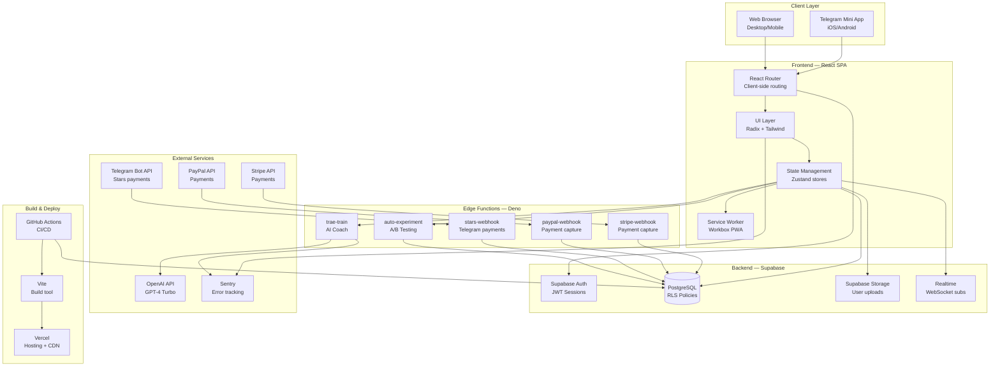
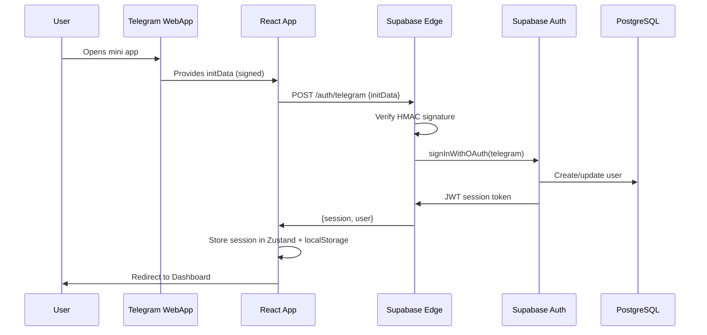
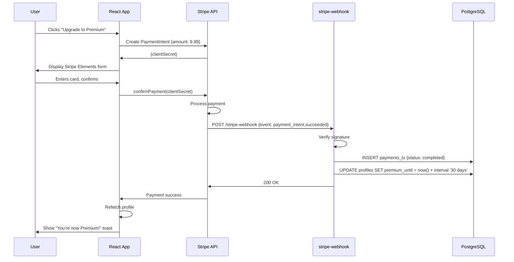
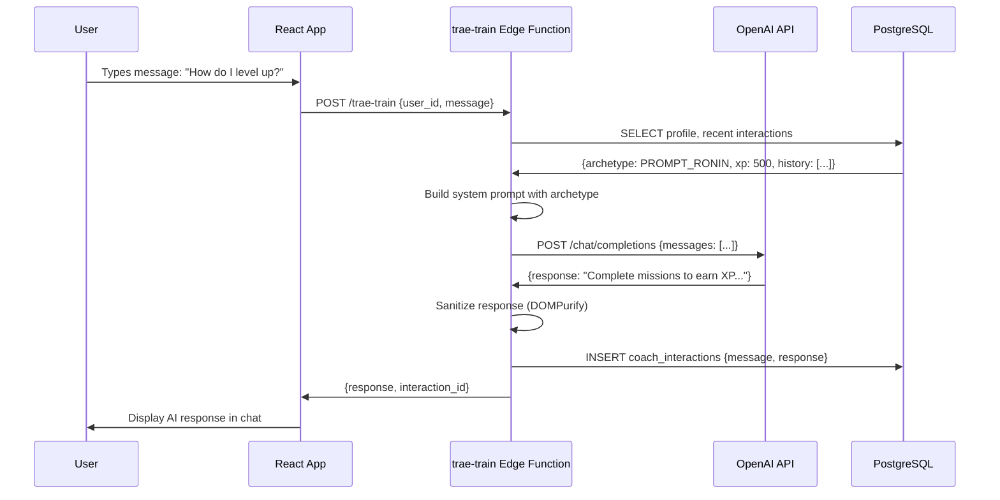
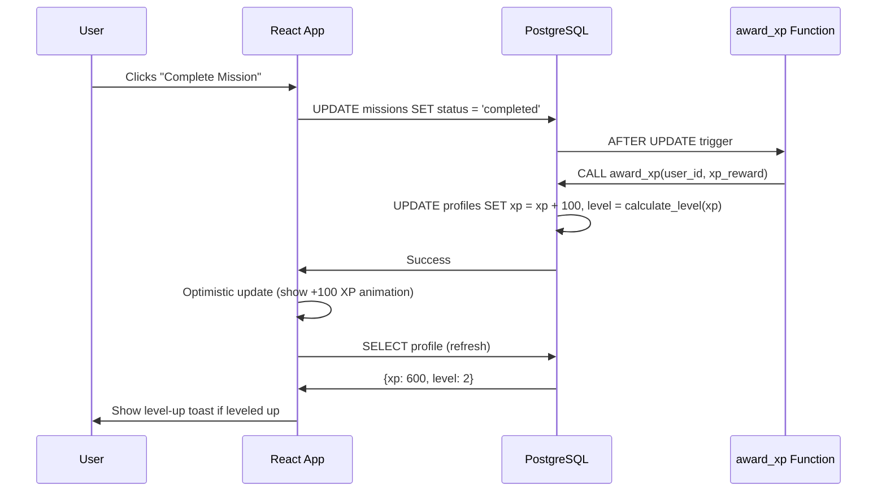
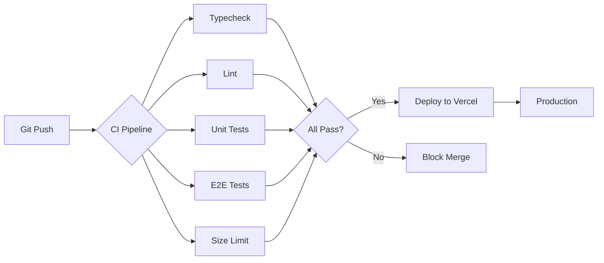

# 🏗️ NEUROPUL AI — ARCHITECTURE OVERVIEW

**Version:** 1.0
**Status:** Specification (0% Implemented)
**Last Updated:** 2025-10-11

---

## 📐 SYSTEM ARCHITECTURE

### High-Level Diagram



---

## 🧩 MODULE BREAKDOWN

### 1. Frontend Application (React/TypeScript/Vite)

**Location:** `/src`

**Key Modules:**

| Module | Path | Responsibility |
|--------|------|----------------|
| **Entry Point** | `src/main.tsx` | React app bootstrap, Sentry init |
| **Routing** | `src/routes.tsx` | React Router v6 route definitions |
| **State** | `src/stores/*` | Zustand global state (auth, profile, missions, UI) |
| **UI Components** | `src/components/ui/*` | Reusable Radix UI wrappers (Button, Dialog, Card) |
| **Layout** | `src/components/layout/*` | Shell, Header, Footer |
| **Feature Components** | `src/components/features/*` | Domain-specific (QuizStep, ChatMessage, MissionCard) |
| **Pages** | `src/pages/*` | Route components (Landing, Quiz, Coach, Premium, Dashboard) |
| **Supabase Client** | `src/lib/supabase/*` | Supabase client, queries, types |
| **Telegram Integration** | `src/lib/telegram/*` | Telegram WebApp SDK, auth, mock mode |
| **Payment Adapters** | `src/lib/payments/*` | Stripe, PayPal, Telegram Stars clients |
| **AI Client** | `src/lib/ai/*` | OpenAI client (edge function wrapper) |
| **Utilities** | `src/utils/*` | XP calculations, formatting, validation |
| **Hooks** | `src/hooks/*` | Custom React hooks (useAuth, useProfile, useMissions) |
| **Types** | `src/types/*` | TypeScript interfaces (User, Mission, Payment) |
| **Constants** | `src/constants/*` | Archetypes, feature flags, config |

**Tech Stack:**
- React 18.2 (createRoot, Suspense, lazy)
- TypeScript 5.2 (strict mode)
- Vite 4.5 (build tool, HMR)
- React Router 6.17 (client-side routing)
- Zustand 4.4 (state management)
- Radix UI (accessible primitives)
- Tailwind CSS 3.3 (utility-first styling)
- Framer Motion 10.16 (animations)
- @tanstack/react-query 5.8 (data fetching, caching)

---

### 2. Database Layer (PostgreSQL + Supabase)

**Location:** `/supabase`

**Schema:**

| Table | Purpose | Key Columns | RLS Enabled |
|-------|---------|-------------|-------------|
| **profiles** | User profiles, XP, level, archetype | id (UUID), username, archetype, xp, level, premium_until | ✅ |
| **missions** | User missions and progress | id, user_id, title, status, xp_reward | ✅ |
| **payments_tx** | Payment transaction log | id, user_id, provider, amount, status, provider_tx_id, client_request_id | ✅ |
| **config** | Feature flags, system settings | key (PK), value | ✅ (public read) |
| **coach_interactions** | AI chat history | id, user_id, message, response, archetype | ✅ |
| **experiments** (future) | A/B test assignments | id, user_id, variant, client_request_id | ✅ |
| **achievements** (future) | User achievement unlocks | id, user_id, achievement_id, unlocked_at | ✅ |

**RLS Policy Pattern:**

```sql
-- Read: User can only see their own data
CREATE POLICY "Users view own data"
  ON table_name FOR SELECT
  TO authenticated
  USING (auth.uid() = user_id);

-- Write: User can only modify their own data
CREATE POLICY "Users update own data"
  ON table_name FOR UPDATE
  TO authenticated
  USING (auth.uid() = user_id)
  WITH CHECK (auth.uid() = user_id);

-- Insert: User can only insert for themselves
CREATE POLICY "Users insert own data"
  ON table_name FOR INSERT
  TO authenticated
  WITH CHECK (auth.uid() = user_id);
```

**Indexes:**
- Foreign keys (user_id, mission_id, etc.)
- Frequently queried fields (telegram_id, provider_tx_id, client_request_id)
- Status fields (mission.status, payment.status)

**Database Functions:**
- `award_xp(user_id, amount)` — Update XP, recalculate level
- `get_user_tier(user_id)` — Check premium status
- Future: `unlock_achievement(user_id, achievement_id)`

---

### 3. Edge Functions (Supabase Functions / Deno)

**Location:** `/supabase/functions`

**Functions:**

#### `auto-experiment`
**Purpose:** A/B testing, bandit algorithm variant selection

**Input:**
```json
{
  "client_request_id": "uuid-v4",
  "user_id": "uuid",
  "experiment_key": "paywall_cta"
}
```

**Output:**
```json
{
  "variant": "A" | "B",
  "experiment_id": "uuid"
}
```

**Logic:**
1. Check if `client_request_id` exists (idempotency)
2. If exists, return cached variant
3. If new, assign variant (bandit algorithm or random)
4. Store in experiments table
5. Return variant

**Security:**
- CORS: Restrict to app domains
- Auth: Require valid JWT
- Rate limit: 100 req/min per user

---

#### `trae-train`
**Purpose:** AI coach chat endpoint

**Input:**
```json
{
  "user_id": "uuid",
  "message": "How do I increase my XP?",
  "session_id": "uuid" (optional)
}
```

**Output:**
```json
{
  "response": "AI coach response text",
  "interaction_id": "uuid"
}
```

**Logic:**
1. Fetch user profile (archetype, XP, level)
2. Fetch recent coach_interactions (context window)
3. Build archetype-specific system prompt
4. Call OpenAI API (GPT-4 Turbo)
5. Sanitize response (remove potential XSS)
6. Store interaction in DB
7. Return response

**Security:**
- CORS: Restrict to app domains
- Auth: Require valid JWT
- Rate limit: 50 messages/day per user
- Input validation: Max 5000 chars

---

#### `stripe-webhook`
**Purpose:** Handle Stripe payment events

**Input:** Stripe webhook payload (POST)

**Output:**
```json
{ "received": true }
```

**Logic:**
1. Verify webhook signature (Stripe secret)
2. Parse event type
3. Handle `payment_intent.succeeded`:
   - Extract payment details
   - Check idempotency (provider_tx_id)
   - Insert into payments_tx (status: completed)
   - Update profile.premium_until (+30 days)
4. Log event to Sentry
5. Return 200 OK

**Security:**
- Webhook signature verification (CRITICAL)
- Idempotency (no double-charge)
- Server-side amount validation

---

#### `paypal-webhook`
**Purpose:** Handle PayPal payment events

**Input:** PayPal webhook payload (POST)

**Output:**
```json
{ "received": true }
```

**Logic:** Similar to stripe-webhook

---

#### `telegram-stars-webhook`
**Purpose:** Handle Telegram Stars payment events

**Input:** Telegram Bot API webhook (POST)

**Output:**
```json
{ "received": true }
```

**Logic:** Similar to stripe-webhook, verify Telegram secret token

---

### 4. External Service Integrations

#### OpenAI (AI Coach)
- **API:** GPT-4 Turbo
- **Use Case:** AI coach responses
- **Rate Limit:** Monitor token usage, set per-user quotas
- **Fallback:** Cached responses or simpler model (GPT-3.5)

#### Stripe (Payments)
- **API:** Stripe Elements + Server API
- **Use Case:** Premium subscription, one-time purchases
- **Compliance:** PCI-DSS (delegated to Stripe)
- **Test Mode:** Separate test keys, test card 4242 4242 4242 4242

#### PayPal (Payments)
- **API:** PayPal JS SDK + REST API
- **Use Case:** Alternative payment method
- **Compliance:** PCI-DSS (delegated to PayPal)
- **Test Mode:** Sandbox account

#### Telegram Bot API (Stars, Auth)
- **API:** Telegram Bot API + WebApp SDK
- **Use Case:** Telegram Stars payments, user auth (initData)
- **Security:** Verify initData HMAC signature

#### Sentry (Error Tracking)
- **Use Case:** Frontend + edge function errors
- **Privacy:** No PII in error logs
- **Alerting:** Slack/PagerDuty for critical errors

---

## 🔄 DATA FLOWS

### Flow 1: User Authentication (Telegram WebApp)



**Key Points:**
- initData must be verified server-side (HMAC with bot token)
- Session stored client-side (JWT + refresh token)
- Supabase Auth handles session refresh automatically

---

### Flow 2: Payment (Stripe Example)



**Key Points:**
- Amount is set server-side (never trust client)
- Webhook signature MUST be verified
- Idempotency: Check `provider_tx_id` before insert
- Client polls or subscribes to profile changes

---

### Flow 3: AI Coach Interaction



**Key Points:**
- Context window: last 10 interactions
- Archetype-specific system prompt
- Sanitize AI output to prevent XSS
- Rate limit: 50 messages/day per user

---

### Flow 4: Mission Completion → XP Award



**Key Points:**
- XP updates via server-side function ONLY (no client XP writes)
- Optimistic UI update for instant feedback
- Level calculation: `level = floor(xp / 1000) + 1` (example)

---

## 🗂️ OWNERSHIP MAP

| Capability | Code Location | Owner/Team |
|------------|---------------|------------|
| **UI/UX** | `/src/components`, `/src/pages` | Frontend Team |
| **State Management** | `/src/stores` | Frontend Team |
| **Database Schema** | `/supabase/migrations` | Backend Team |
| **RLS Policies** | `/supabase/migrations` | Backend Team |
| **Edge Functions** | `/supabase/functions` | Backend Team |
| **Payment Integration** | `/src/lib/payments`, `/supabase/functions/*-webhook` | Backend + Payments Team |
| **AI Coach** | `/supabase/functions/trae-train`, `/src/constants/archetypes.ts` | AI Team |
| **Auth** | `/src/lib/telegram/auth.ts`, Supabase Auth | Backend Team |
| **Testing** | `/tests` | QA + All Teams |
| **CI/CD** | `/.github/workflows` | DevOps |
| **Deployment** | Vercel, Supabase | DevOps |
| **Monitoring** | Sentry, Supabase Dashboard | DevOps + Backend |

---

## 🔐 SECURITY MODEL

### Defense in Depth

1. **Client-Side**
   - CSP headers (restrict inline scripts, external domains)
   - Input validation (Zod schemas)
   - XSS prevention (React escapes by default, sanitize AI outputs)
   - HTTPS enforcement (HSTS)

2. **Transport**
   - TLS 1.3 (Vercel, Supabase)
   - Secure cookies (httpOnly, secure, sameSite)
   - JWT tokens (short-lived, refresh token rotation)

3. **Backend (Edge Functions)**
   - Authentication (verify JWT on every request)
   - Authorization (check user ownership)
   - Input validation (Zod)
   - Rate limiting (token bucket)
   - CORS (whitelist app domains)

4. **Database (PostgreSQL + RLS)**
   - Row-Level Security (100% coverage)
   - Default-deny policies
   - Server-only fields (xp, level, premium_until)
   - Immutable audit logs (payments_tx)

5. **External Services**
   - Webhook signature verification (Stripe, PayPal, Telegram)
   - API key rotation (quarterly)
   - Least privilege (service_role_key only in edge functions)

---

## 📦 BUILD & DEPLOYMENT PIPELINE

### Local Development

```bash
# 1. Start Supabase locally
supabase start

# 2. Apply migrations
supabase db push

# 3. Apply seeds
supabase db execute --file supabase/seed/local_flags.sql

# 4. Start edge functions
supabase functions serve --no-verify-jwt

# 5. Start frontend
npm run dev
```

**Access Points:**
- Frontend: http://localhost:5173
- Supabase Studio: http://localhost:54323
- Supabase API: http://localhost:54321
- Edge Functions: http://localhost:54321/functions/v1

---

### CI/CD Pipeline (GitHub Actions)



**Environments:**
- **Development:** Every PR → Preview deployment (Vercel)
- **Staging:** `develop` branch → staging.neuropul.app
- **Production:** `main` branch → neuropul.app

---

### Build Optimization (Vite Config)

**Chunking Strategy:**
- `react-core.js` — React runtime (~40KB gzip)
- `react-dom.js` — ReactDOM (~130KB gzip)
- `react-router.js` — Router (~20KB gzip)
- `supabase.js` — Supabase client (~50KB gzip)
- `framer-motion.js` — Lazy loaded (~80KB gzip)
- `vendor.js` — Small utilities (~30KB gzip)
- `app.js` — Main app code (~50KB gzip)

**Target Bundle:**
- Main bundle: ≤ 400KB gzip
- Route chunks: ≤ 100KB gzip each

**Optimizations:**
- Tree-shaking (Vite/Rollup)
- Terser minification (drop_console, unsafe optimizations)
- CSS code-splitting
- Lazy route loading (React.lazy)
- Service worker caching (Workbox)

---

## 🎯 FEATURE FLAGS (config table)

| Flag Key | Purpose | Default |
|----------|---------|---------|
| `auto.experiment.enabled` | Enable A/B testing | false |
| `trae.selftrain.enabled` | Enable AI self-training | false |
| `evolution.scheduler.enabled` | Enable scheduled evolution | false |
| `cognitive.graph.enabled` | Enable cognitive graph UI | true |
| `meta.insight.enabled` | Enable meta-insights feature | true |
| `payments.stripe.enabled` | Enable Stripe payments | true |
| `payments.paypal.enabled` | Enable PayPal payments | true |
| `payments.stars.enabled` | Enable Telegram Stars | true |

**Usage (Client):**
```ts
const { data: flags } = await supabase
  .from('config')
  .select('key, value')

const isFeatureEnabled = (key: string) => flags[key] === 'true'
```

**Usage (Edge Function):**
```ts
const { data } = await supabase.from('config').select('value').eq('key', 'trae.selftrain.enabled').single()
if (data.value === 'true') {
  // Feature logic
}
```

---

## 📚 DEPENDENCY TREE (Key Runtime Deps)

```
neuropul-trae-ai
├── react@18.2.0 (UI library)
├── react-dom@18.2.0 (DOM renderer)
├── react-router-dom@6.17.0 (routing)
├── @supabase/supabase-js@2.38.4 (backend client)
├── zustand@4.4.6 (state management)
├── @tanstack/react-query@5.8.4 (data fetching)
├── framer-motion@10.16.4 (animations)
├── @radix-ui/react-dialog@1.0.5 (accessible modals)
├── @radix-ui/react-dropdown-menu@2.0.6 (accessible dropdowns)
├── @radix-ui/react-tabs@1.0.4 (accessible tabs)
├── clsx@2.0.0 (classname utility)
├── tailwind-merge@2.0.0 (classname merging)
├── lucide-react@0.292.0 (icons)
└── workbox-window@7.0.0 (service worker)
```

**Dev Dependencies:**
- TypeScript 5.2.2 (type safety)
- Vite 4.5.0 (build tool)
- Vitest 0.34.6 (unit testing)
- Playwright 1.39.0 (E2E testing)
- ESLint 8.53.0 (linting)
- Prettier 3.0.3 (formatting)

---

## 🚀 PERFORMANCE CHARACTERISTICS

**Target Metrics:**
- **LCP (Largest Contentful Paint):** ≤ 1.8s (p75)
- **INP (Interaction to Next Paint):** ≤ 150ms (p75)
- **CLS (Cumulative Layout Shift):** ≤ 0.07
- **FCP (First Contentful Paint):** ≤ 1.0s
- **TTFB (Time to First Byte):** ≤ 200ms
- **Bundle Size (Main):** ≤ 400KB gzip

**PWA Capabilities:**
- Offline mode (service worker caches assets + API responses)
- Install prompt (A2HS — Add to Home Screen)
- Background sync (queue mutations when offline)
- Push notifications (future)

---

## 🔍 OBSERVABILITY

### Metrics (Collected)
- Page views (per route)
- User actions (button clicks, form submits)
- Payment events (initiated, succeeded, failed)
- AI coach interactions (messages sent, response time)
- XP earned (per user, per mission)
- Errors (client + edge functions)

### Logging Strategy
- **Client:** Sentry (errors only, no verbose logs in prod)
- **Edge Functions:** Structured JSON logs (console.log)
- **Database:** PostgreSQL logs (via Supabase Dashboard)

### Alerting
- Sentry → Slack: Critical errors (payment failures, auth failures)
- Uptime monitoring: Vercel Analytics + Supabase status page
- On-call rotation: PagerDuty (optional)

---

## 📈 SCALABILITY CONSIDERATIONS

**Current Design (v1):**
- Supabase Free Tier: 500MB DB, 2GB bandwidth/month
- Vercel Free Tier: 100GB bandwidth/month
- Expected load: 100-1000 DAU

**Scaling Path:**
1. **Phase 1 (0-1K users):** Free tiers sufficient
2. **Phase 2 (1K-10K users):** Upgrade Supabase to Pro ($25/mo), Vercel to Pro ($20/mo)
3. **Phase 3 (10K-100K users):** Optimize queries, add caching (Redis), consider CDN for static assets
4. **Phase 4 (100K+ users):** Migrate to dedicated Postgres, add read replicas, implement rate limiting at edge

**Bottlenecks:**
- OpenAI API rate limits (monitor TPM — tokens per minute)
- Database connection pool (Supabase scales automatically)
- Edge function cold starts (Deno has fast cold start, ~50ms)

---

## 🛠️ DEVELOPMENT TOOLS

| Tool | Purpose | Config File |
|------|---------|-------------|
| TypeScript | Type safety | `tsconfig.json` |
| Vite | Build tool | `vite.config.ts` |
| Tailwind CSS | Styling | `tailwind.config.js` |
| ESLint | Linting | `.eslintrc.js` (missing) |
| Prettier | Formatting | `.prettierrc` (missing) |
| Vitest | Unit testing | `vitest.config.ts` (auto-detect) |
| Playwright | E2E testing | `playwright.config.ts` (missing) |
| Size Limit | Bundle budget | `.size-limit.json` (missing) |
| Lighthouse CI | Performance | `.lighthouserc.js` (missing) |

---

## 🎓 ONBOARDING (New Dev Checklist)

- [ ] Read this document (ARCHITECTURE_OVERVIEW.md)
- [ ] Read SECURITY_AUDIT.md (understand threat model)
- [ ] Read AAA_IMPLEMENTATION_ROADMAP.md (understand phases)
- [ ] Install dependencies: `npm install`
- [ ] Set up `.env.local` (copy from `.env.local.example`)
- [ ] Start Supabase: `make dev` (or `supabase start`)
- [ ] Run frontend: `npm run dev`
- [ ] Access app: http://localhost:5173
- [ ] Read code in `/src/components/ui` (understand component patterns)
- [ ] Try completing a task from NEUROPUL_TODO.md

**Estimated Onboarding Time:** 2-4 hours

---

## 📞 CONTACTS & RESOURCES

- **Project Lead:** [Name]
- **Backend Lead:** [Name]
- **Frontend Lead:** [Name]
- **DevOps:** [Name]

**Documentation:**
- Architecture: `/docs/ARCHITECTURE.md` (this file)
- API Reference: `/docs/API.md`
- Security: `/docs/SECURITY.md`
- Runbook: `/docs/RUNBOOK.md`

**External Resources:**
- Supabase Docs: https://supabase.com/docs
- Telegram WebApp API: https://core.telegram.org/bots/webapps
- Stripe Docs: https://stripe.com/docs/api
- Vercel Docs: https://vercel.com/docs

---

**End of Architecture Overview**

**Status:** This document describes the **planned architecture** for Neuropul AI. As of 2025-10-11, **0% of the implementation exists**. See AAA_IMPLEMENTATION_ROADMAP.md for the build plan.
